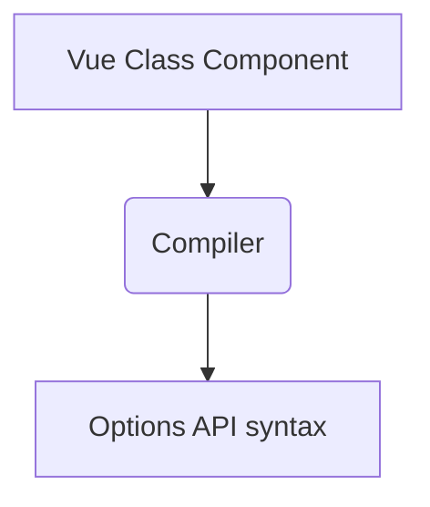

# How are we going to build it

The master plan

---

# Upgrade all the things

- Make sure we're on the latest Vue 2 version, i.e. Vue 2.7
- `defineComponent` was backported from Vue 3 and increases type inference
- There are also other cool features:
    - Emit type-checking
    - Overall better type checking at compile time

---

# Class based-syntax (revisited)

```ts {*|1|4|5|6|8|10|12-13|15-16|18|20}
import { Component, Prop, Vue, Ref, Emit, Watch, mixins } from 'vue-property-decorator'
/* other imports */

@Component({ components: { NestedComponent }})
export default class ExampleComponent extends mixins(MyMixin) {
  @Ref('myDiv') readonly myDiv!: HTMLDivElement

  @Prop({ type: Number, required: true }) public readonly myNumber!: number

  myData = 'stuff'

  @Watch('myNumber', { immediate: true, deep: true })
  onMyDataOne(newVal: string, oldVal:string) { }

  @Emit('my-event')
  emitMyEventWithPayloadParam (num: number): void { }

  get myMethod () { }

  doMath(a: number, b: number): number { }
}
```

---

# Old-School Vue 2 Options API

```ts
export default {
  name: 'ExampleComponent',
  components: { NestedComponent },
  mixins: [MyMixin],
  props: { myNumber: { type: Number, required: true } },
  data() { return {  myData: 'stuff' }},
  watch: {
    myNumber: { deep: true, immediate: true, handler(newNumber: number, oldNumber: number) { } }
  }
  computed: { myMethod() { } },
  methods: { doMath(a: number, b: number): number { } }
}
```

Some problems with this syntax:
- Notice the lack of `ref` and `emit` declarations!
- Type support is severely limited

---

# New-School Vue 3* Options API

````md magic-move {lines: true}
```ts {*|6}
export default defineComponent({
  name: 'ExampleComponent',
  components: { NestedComponent },
  mixins: [MyMixin],
  props: { myNumber: { type: Number as PropType<number>, required: true } },
  emits: { 'my-event'(): boolean { return true } },
  data() { return {  myData: 'stuff' }},
  watch: {
    myNumber: { deep: true, immediate: true, handler(newNumber: number, oldNumber: number) { } }
  },
  computed: { myMethod() { } },
  methods: { doMath(a: number, b: number): number { } }
})
```

```ts {13}
export default defineComponent({
  name: 'ExampleComponent',
  components: { NestedComponent },
  mixins: [MyMixin],
  props: { myNumber: { type: Number as PropType<number>, required: true } },
  emits: { 'my-event'(): boolean { return true } },
  data() { return {  myData: 'stuff' }},
  watch: {
    myNumber: { deep: true, immediate: true, handler(newNumber: number, oldNumber: number) { } }
  },
  computed: {
    myMethod() { },
    myDiv() { return this.$refs.myDiv as HTMLDivElement }
  },
  methods: { doMath(a: number, b: number): number { } }
})
```
````

- Relies on the `defineComponent` method (* also available on Vue 2.7)
- Much better type support

---

# From Class-based to Options API Syntax

| Class-based syntax  | Options API Syntax |
|---------------------|--------------------|
| [`@Prop`](https://github.com/kaorun343/vue-property-decorator#-propoptions-propoptions--constructor--constructor---decorator) | [`props`](https://vuejs.org/api/options-state.html#props) |
| [`@Watch`](https://github.com/kaorun343/vue-property-decorator#-watchpath-string-options-watchoptions---decorator) | [`watch`](https://vuejs.org/api/options-state.html#watch) |
| [`@Emit`](https://github.com/kaorun343/vue-property-decorator#-emitevent-string-decorator) | `$emit` method with [`emits`](https://vuejs.org/api/options-state.html#emits) option will allow us to have type support 🎉 |
| [`@Ref`](https://github.com/kaorun343/vue-property-decorator#-refrefkey-string-decorator) | `$ref` property only inside `computed` object |
| [`Data`](https://class-component.vuejs.org/guide/class-component.html#data) | [`data`](https://vuejs.org/api/options-state.html#data) function |
| [`Methods`](https://class-component.vuejs.org/guide/class-component.html#methods) | [`methods`](https://vuejs.org/api/options-state.html#methods) |

--- 

# From Class-based to Options API Syntax (continued)

| Class-based syntax  | Options API Syntax |
|---------------------|--------------------|
| [`Lifecycle Hooks`](https://class-component.vuejs.org/guide/class-component.html#hooks) | [`Lifecycle Hooks`](https://vuejs.org/api/options-lifecycle.html) are pretty much the same |
| [`Mixins`](https://class-component.vuejs.org/guide/extend-and-mixins.html#extend-and-mixins) | [`mixins`](https://v2.vuejs.org/v2/guide/mixins.html?redirect=true) are deprecated in Vue 3, but we'll keep them for now |
| Class [`getters and setters`](https://www.typescriptlang.org/docs/handbook/2/classes.html#getters--setters) | [Computed](https://vuejs.org/api/options-state.html#computed) property declaration |

---

# How can we do this automatically?

### Compilers to the rescue

<div grid="~ cols-2">
<div class="text-center">

</div>
<div>

For each SFC:
- `<script>` block:
    - Transform the class based syntax to Options API syntax;
    - Imports will remain the same;
    - Logic will remain the same
- `<template>` and `<style>` blocks will remain the same

</div>
</div>

