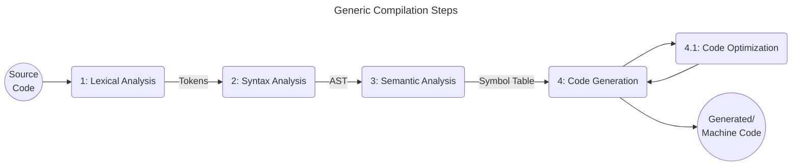

# Compilers 101

---

# Compilation Steps



<div v-click grid="~ gap-2 cols-2">

<div>
Let's take a look at this very simple (and very dumb) example function to walk us through the compilation* process.

<div font="thin" text="sm">*Actually, compilation requires the result to be binary code. Since the TypeScript compiler transforms the code to JavaScript, it is actually called transpilation.</div>
</div>

```ts
function isEven(num: number): boolean {
    学中文
    const notUsed = 123
    if num % 2 === 0 {
        return true
        🍌
    } else [
        false 1 ; return
    ]
}
```

</div>

---

# 1. Lexical Analysis

- Analyze tokens in the source code, usually done with the help of regular expressions;
- Think of this step as the language's dictionary;
- Makes sure there is no unwanted content in the source code;
- Produces tokens which feeds into the next step;

<div grid="~ cols-3 gap-2">

<div class="col-span-2">

````md magic-move 
```ts
function isEven(num: number): boolean {
    学中文 // <-- ❌ LEXICAL ERROR:
    // chinese characters are not part of TypeScript's Lexicon
    const notUsed = 123
    if num % 2 === 0 {
        return true
        🍌 // <-- ❌ LEXICAL ERROR: neither are emojis
    } else [
        false 1 ; return
    ]
}
```

```ts
function isEven(num: number): boolean {
    const notUsed = 123
    if num % 2 === 0 {
        return true
    } else [
        false 1 ; return
    ]
}
```
````
</div>
<div v-click>
```
- FUNCTION_KEYWORD "function"
- IDENTIFIER "isEven"
- LEFT_PAREN "("
- IDENTIFIER "num"
- COLON ":"
- IDENTIFIER "number"
- RIGHT_PAREN ")"
- LEFT_BRACKET "{"
- ...
```
</div>
</div>

---

# 2. Syntax Analysis

- Analyzes the tokens and their order with each other to make sure that the source code is syntactically correct;
- Examples: variable, function and class declarations, conditional statements, etc. So an `if` statement without `(` right after is a syntactical error;
- Produces an [Abstract Syntax Tree (`AST`)](https://en.wikipedia.org/wiki/Abstract_syntax_tree) with feeds into the next step;


````md magic-move 
```ts
function isEven(num: number): boolean {
    const notUsed = 123
    if num % 2 === 0 { // ❌ SYNTAX ERROR: missing "("
        return true
    } else [ // ❌ SYNTAX ERROR: expected "{" or statement
        false 1 ; return // ❌ SYNTAX ERROR: wtf?
    ]
}
```

```ts
function isEven(num: number): boolean {
    const notUsed = 123
    if (num % 2 === 0) {
        return true
    } else {
        return false
    }
}
```
````

---

# 2. Syntax Analysis (AST)

<figure h-96 flex="~ justify-center">
    
</figure>

<div v-click absolute top-64 left-105 z-10>
```ts
const notUsed = 123
```
</div>

<div v-click absolute top-44 left-165 z-10>
```ts
if (num % 2 === 0) {
    return true
} else {
    return false
}
```
</div>

---

# 3. Semantic Analysis

- Analyzes the AST and makes sure that the code "makes sense"
- Example: if a variable or function is used but not declared, there's a semantical error
- Produces a [symbol table](https://en.wikipedia.org/wiki/Symbol_table) during the analysis for the next step

````md magic-move 
```ts
function isEven(num: number): boolean {
    const notUsed = 123
    if (num % 2 === 0) {
        return true
    } else {
        return "not-a-boolean" // ❌ SEMANTIC ERROR: expected type "boolean" but got type "string"
    }
}
```

```ts
function isEven(num: number): boolean {
    const notUsed = 123
    if (num % 2 === 0) {
        return true
    } else {
        return false
    }
}
```
````

---

# 3. Semantic Analysis (Symbol Table)

- Data structure which contain information about the declared functions, classes, methods, variables and so on;
- Each code block as its owns scope, so its only natural for each block to have its own symbol table.

In our code example, we would have symbol tables for:
    <!-- - the entire file, which would contain `isEven` function signature
    - the `isEven` function scope, which would contain the `notUsed` variable declaration
    - and then one for the if block and another for the else block -->

```ts
// File's symbol table
function isEven(num: number): boolean {
    // isEven Function symbol table
    const notUsed = 123
    if (num % 2 === 0) {
        // if scope symbol table
        return true
    } else {
        // else scope symbol table
        return false
    }
}
```

---

# 3. Semantic Analysis (Symbol Table)

<div grid="~ cols-2 gap-2">

<div>

```ts {*|1,3,10|1,3,4,7,10,11,16|*}
const myVar = 'file-scope'
function isEven(num: number): boolean {
    const myVar = 'function-scope'
    console.log("[isEven]: ", myVar)

    if (num % 2 === 0) {
        console.log("[if]: ", myVar)
        return true
    } else {
        const myVar = 'else-block-scope'
        console.log("[else]: ", myVar)
        return false
    }
}

console.log("[file]: ", myVar)
console.log("\n")
isEven(1)
console.log("\n")
isEven(2)
```

</div>

<div v-click>

```txt
[file]: file-scope

[isEven]: function-scope
[else]: else-block-scope

[isEven]: function-scope
[if]: function-scope
```

</div>
</div>

---

# 4. Code Generation

- Having gone through the previous steps, we can make sure the code makes sense (so it compiles 🚀);
- Given the AST and Symbol Table we are now able to generate the wanted code for each node;

```js
"use strict";
function isEven(num) {
    const notUsed = 123;
    if (num % 2 === 0) {
        return true;
    }
    else {
        return false;
    }
}
```

---

# 4.1 Code Optimization

- This step is not necessarily done after the code generation, it can be done before or during
- Takes the AST and Symbol Table and optimizes the code

Example: remove unreachable/dead code, remove's unused declarations (variables, functions, imports, ...), removes unnecessary tokens

```js
"use strict";
function isEven(num) {
    return num % 2 === 0
}
```

