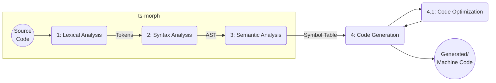
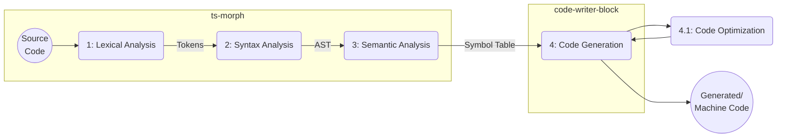

# In practice

---

# TypeScript AST

- [TypeScript AST Viewer](https://ts-ast-viewer.com/#)
- You can take a look at a [Class Syntax Example](https://ts-ast-viewer.com/#code/JYWwDg9gTgLgBAbzgYQuCA7AphmAaOABSgjAIDUBXLAgJSwDMCBREYfOAdQEMYBjABZwAvnAYkQcAOQA3agFowJMFlgBPeQBMsfaL2hSAUKEiw4AOSwBnGFk2p02XGInSAdAHpLNuw8hOYNzksI2NcVQZuPiw4AFk1AElwqEjoxEM4TLgQNWJSVRg1AC44GyhgDABzQ2FDQw8POAEYGDArIobK9gFKACM3XRAPAGtuaEoMAGYAFkmPYMVlAo1tXSh9KEMAAT9MHBgACgQMrMH-ffb0rOuLa1t7NHPcPBPM4RfhAEpDLAAPU3g2kilAANvA+CDuFYrHBmL9uOAQVhdgE4H9bBhNDCqDFjtcGnB6AwrK84FsiQcpDkACLAGRSb7XKBYbiaTAgtTZNS0mQAQhKAAkACqxAAyPOYSJA+zq+MaeTapK2CqOcEKKhKACEIBAkdwMAQgdxQTASjAoNQRIysmA+iDgHw4MzWezOUaTdrdSyMPy4L0dXqMLKssrlKr1VgSgBlc0VSqGxjGsElKSkGDATBwACMUitpNtvXtjudbIwHLg7rBCt9qbA6czObgAB9pGmMxg4AAmULXUOkcNqDVwGPlKoEZkAR0owGZmjNFpiX3zdodTpZpfLk+ns5HcerJTKceDmT7YAHQ93Y7XU5ndhKkRBVkX1syBaLa5dZc5GAgMHoN53WMqgVAB+A8gOqJUVSQCMSgAeV6AArHR4CXa431XEtXTgCAkJQ0CSniJJbBSKIsGPOACU0XhuFJGkaLg7A4AAXmkaIMChIx0PKGReBiHJiDpPjqRoljpBAaAYhsSgGAYHssgJHh+AEJUlMESl6JgbhGJCAgkFAaVNGAPj52oBMsDAUzn1JTB4hErSdIObAAHdyG4EFwNHeMcJBTQ3I8w8qk+K4bkyXQMCsL03BBCBKgOAADQR9UqOwXDQOAABIEF1Pz3NEGAIEyhAXP84ReXil8RAoglWHYEle1qw4qQ0LAZH2BlSSwNgYHiZg2ucA5PhKGQIGATREFqJVGo0lr+pgeRnO6RRuDUGLWWW9YQA664uvYXq5s4bpCBWtbNGOza4CcygQBKDBrt6VQhrgEaxpC0KYAEYArDcTTtKY1jU0oc1uDgdjuC4rJJoa7qZvkVr9gWpawBOiB1uZGBKCgDBtqyXaerUPr9kOj7jtW1HNHoDGscuu6brgWmHqgJ7AsqN6bg+r6ftyHjhNEgGJOZbJJNKDHZIh0L0cxjsOe+gSedsezaOuKGFMaM4gbsUkUvgX6dIAVTAFQoD4KEYkGtmmSwKnpc+2XuQY7A3AKg2jeQU3BtJFXMgJaUPogLFSRiyoozQK3PqqS7It98PKhKfU1Cel7xrxULQcwSKkWi2KDijsO40qr2KwgWJeAEA5uFu+7VAIXpK5ARmnoZ1QLaySXqZBgBqP1PYotkQ+juNiYEClgpT97ba5nk3FZTRCdwUUvoxVRKQhB1hikAhzeYgA+NUJ6D-u86qA4ZbcNkS4+g4szwLNPjvnvOu6gBBEEQSFAQsHfuMYUG4bRuT0k1xT5432vsD2qc96cxAQTA6R0UasnOgiA4nZKpAIntAueMAh6k1OpTKWyCC41CAA)


---

# A further look into the AST

(look at the [example](https://ts-ast-viewer.com/#code/JYWwDg9gTgLgBAbzgYQuCA7AphmAaOABSgjAIDUBXLAgJSwDMCBREYfOAdQEMYBjABZwAvnAYkQcAOQA3agFowJMFlgBPeQBMsfaL2hSAUKEiw4AOSwBnGFk2p02XGInSAdAHpLNuw8hOYNzksI2NcVQZuPiw4AFk1AElwqEjoxEM4TLgQNWJSVRg1AC44GyhgDABzQ2FDQw8POAEYGDArIobK9gFKACM3XRAPAGtuaEoMAGYAFkmPYMVlAo1tXSh9KEMAAT9MHBgACgQMrMH-ffb0rOuLa1t7NHPcPBPM4RfhAEpDLAAPU3g2kilAANvA+CDuFYrHBmL9uOAQVhdgE4H9bBhNDCqDFjtcGnB6AwrK84FsiQcpDkACLAGRSb7XKBYbiaTAgtTZNS0mQAQhKAAkACqxAAyPOYSJA+zq+MaeTapK2CqOcEKKhKACEIBAkdwMAQgdxQTASjAoNQRIysmA+iDgHw4MzWezOUaTdrdSyMPy4L0dXqMLKssrlKr1VgSgBlc0VSqGxjGsElKSkGDATBwACMUitpNtvXtjudbIwHLg7rBCt9qbA6czObgAB9pGmMxg4AAmULXUOkcNqDVwGPlKoEZkAR0owGZmjNFpiX3zdodTpZpfLk+ns5HcerJTKceDmT7YAHQ93Y7XU5ndhKkRBVkX1syBaLa5dZc5GAgMHoN53WMqgVAB+A8gOqJUVSQCMSgAeV6AArHR4CXa431XEtXTgCAkJQ0CSniJJbBSKIsGPOACU0XhuFJGkaLg7A4AAXmkaIMChIx0PKGReBiHJiDpPjqRoljpBAaAYhsSgGAYHssgJHh+AEJUlMESl6JgbhGJCAgkFAaVNGAPj52oBMsDAUzn1JTB4hErSdIObAAHdyG4EFwNHeMcJBTQ3I8w8qk+K4bkyXQMCsL03BBCBKgOAADQR9UqOwXDQOAABIEF1Pz3NEGAIEyhAXP84ReXil8RAoglWHYEle1qw4qQ0LAZH2BlSSwNgYHiZg2ucA5PhKGQIGATREFqJVGo0lr+pgeRnO6RRuDUGLWWW9YQA664uvYXq5s4bpCBWtbNGOza4CcygQBKDBrt6VQhrgEaxpC0KYAEYArDcTTtKY1jU0oc1uDgdjuC4rJJoa7qZvkVr9gWpawBOiB1uZGBKCgDBtqyXaerUPr9kOj7jtW1HNHoDGscuu6brgWmHqgJ7AsqN6bg+r6ftyHjhNEgGJOZbJJNKDHZIh0L0cxjsOe+gSedsezaOuKGFMaM4gbsUkUvgX6dIAVTAFQoD4KEYkGtmmSwKnpc+2XuQY7A3AKg2jeQU3BtJFXMgJaUPogLFSRiyoozQK3PqqS7It98PKhKfU1Cel7xrxULQcwSKkWi2KDijsO40qr2KwgWJeAEA5uFu+7VAIXpK5ARmnoZ1QLaySXqZBgBqP1PYotkQ+juNiYEClgpT97ba5nk3FZTRCdwUUvoxVRKQhB1hikAhzeYgA+NUJ6D-u86qA4ZbcNkS4+g4szwLNPjvnvOu6gBBEEQSFAQsHfuMYUG4bRuT0k1xT5432vsD2qc96cxAQTA6R0UasnOgiA4nZKpAIntAueMAh6k1OpTKWyCC41CAA))


---

# Meaning behing the nodes

| AST Node(s)  | Vue SFC Meaning |
| ------------ | --------------- |
| `ClassDeclaration` with `'@Component' Decorator` | Component definition with child components |
| `ClassDeclaration` with `'mixin' CallExpression` in `HeritageClause` | Mixin declaration |
| `PropertyDeclaration` with `'@Ref' Decorator` | Ref declaration |
| `PropertyDeclaration` with `'@Prop' Decorator` | Prop declaration |
| `PropertyDeclaration` without any `Decorator` child node | Data declaration |

---

# Meaning behing the nodes

| AST Node(s)  | Vue SFC Meaning |
| ------------ | --------------- |
| `MethodDeclaration` with `'@Watch' Decorator` | Watch method declaration |
| `MethodDeclaration` with `'@Emit' Decorator` | Emit method declaration |
| `GetAccessor` | Computed property declaration |

---

# Building the AST - Let's not re-invent the wheel

- The [original TypeScript Project](https://github.com/Microsoft/TypeScript) already allows us to build and manipulate the AST;
- We've ended up using [`ts-morph`](https://ts-morph.com/) which simplifies everything



---

# Manipulating the AST

- We don't realy need to manipulate the AST
- We just need to generate code following the options API syntax (`ts-morph` uses [`code-writer-block`](https://github.com/dsherret/code-block-writer))



---

# Building the symbol table

- This is not an actual symbol table... oops
- But is serves our purpose and keeps things simple

```ts
export interface SymbolTable {
  component?: Component,
  data: Data[]
  refs: Ref[]
  props: Prop[]
  hooks: Hook[]
  emits: Emit[]
  watch: Watch[]
  methods: Method[]
  getters: Computed[]
  mixins: Mixin[]
}
```

---

# Visitor Design Pattern Example

[Visitor design pattern](https://refactoring.guru/design-patterns/visitor) to the rescue;

Quick Example: Given a number array *N*, return two arrays of odd and even numbers in *N*:

```ts {*|}
type VisitorFunctionResult = [number[], number[]]
type VisitorFunction = (elem: number, result: VisitorFunctionResult) => VisitorFunctionResult

const array = [1,2,3,4,5,6]
const visitors: VisitorFunction[] = [
  (elem, [odd, even]) => elem % 2 !== 0 ? [[...odd, elem], even] : [odd, even],   // oddVisitor
  (elem, [odd, even]) => elem % 2 === 0 ? [odd, [...even, elem]] : [odd, even],   // evenVisitor
]

const result = visitors.reduce<VisitorFunctionResult>(
  (result, visitor) => array.reduce((_result, e) => visitor(e, _result), result),
  [[], []]
)
```

---

# Putting everything together

In our case: Given as ClassDeclaration AST, return the symbol table with Vue component properties.

```ts
export type VisitorFunction = (node: Node, symbolTable: SymbolTable) => SymbolTable
```

`forEachDescendantAsArray` does exactly what it looks like.

```ts
export function buildSymbolTable(sourceFile: SourceFile, visitors: VisitorFunction[]): SymbolTable {
  return visitors.reduce<SymbolTable>(
    (table: SymbolTable, visitor: VisitorFunction): SymbolTable =>
      sourceFile.forEachDescendantAsArray().reduce<SymbolTable>(
        (_table, node) => visitor(node, _table),
        table
      ),
    createEmptySymbolTable()
  )
}
```

You can take a look at [`visitors.ts`](https://github.com/Infraspeak/decorators-to-object-api-transpiler/blob/master/src/compiler/visitors.ts) file for each visitor function implementation.

---

# Visitor function for `@Prop`

```ts
const propertyDeclarationWithDecoratorVisitor: VisitorFunction = (node: Node, symbolTable: SymbolTable): SymbolTable => {
  const returnSymbolTable = cloneDeep(symbolTable)
  const decorators = node.getChildrenOfKind(SyntaxKind.Decorator)
  if (decorators.length === 0 || node.getKind() !== SyntaxKind.PropertyDeclaration) {
    return returnSymbolTable
  }

  const [decoratorIdentifier, ...rest] = /* Ommited for clarity */
  switch (decoratorIdentifier) {
    case 'Ref':
      // handle ref
    case 'Prop':
      returnSymbolTable.props = [...returnSymbolTable.props, createProp(node as PropertyDeclaration)]
      break
    default:
      throw new Error(`${node.getKindName()} with unknown decorator: ${decoratorIdentifier}`)
  }
  return returnSymbolTable
}
```

---

# A closer look at `@Prop` handling

<div grid="~ cols-2 gap-2">
```ts
export type Prop = {
  structure: Omit<PropertyDeclarationStructure, 'kind'>
  name: string
  isReadonly: boolean
  /**
   * required: true && !
   * required: false && ?
   */
  isRequired: boolean
  /** Vue component property type
   * - String | Number | Boolean | Object | ...
   */
  propType?: string
  /** Typescript native type */
  nativeType: string
  /** initialized value */
  defaultValue?: string
  /** Validator */
  validator?: string
}
```

<div v-click>
```ts
@Prop({
  type: String,
  default: 'option 1',
  validator: (opt) => ['option 1', 'option 2'].includes(opt)
})
public readonly defaultProp!: 'option 1' | 'option 2'
```

```ts
const exampleProp: Prop = {
  structure: "...", /* ts-morph stuff */
  name: "defaultProp",
  isReadonly: true,
  isRequired: false,
  propType: "String",
  nativeType: "'option 1' | 'option 2'",
  defaultValue: "'option 1'",
  validator: "(opt) => ['option 1', 'option 2'].includes(opt)",
}
```

</div>

</div>

---
transition: slide-up
---

# Code Generation

```ts
export function generateProp(prop: Prop, writer: CodeBlockWriter): CodeBlockWriter {
  /** ommited */
  return writer
    .write(`${prop.name}: `).inlineBlock(() => {
      prop.propType && writer.writeLine(`type: ${prop.propType} as PropType<${prop.nativeType}>,`)
      prop.isRequired && writer.writeLine(`required: ${prop.isRequired},`)
      prop.defaultValue && writer.writeLine(`default: ${prop.defaultValue},`)
      prop.validator && writer.writeLine(`validator: ${prop.validator},`)
    })
    .write(',').newLine()
}
```

Will result in

```ts
defaultProp: {
  type: String as PropType<'option 1' | 'option 2'>,
  defaultValue: 'option 1',
  validator: (opt) => ['option 1', 'option 2'].includes(opt),
},
```

